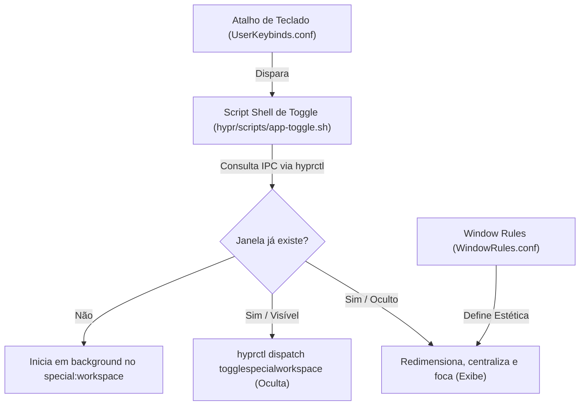

# ⚡ GUIA MESTRE: DROPDOWN SCRATCHPADS NO HYPRLAND
### Como Criar Janelas Ocultas Ultrarrápidas para Qualquer App ou WebApp (O "Modo Ninja" do Linux)

> *"No Windows você é escravo da barra de tarefas e do Alt+Tab caótico. No Arch Linux com Hyprland, qualquer ferramenta do mundo desce flutuando na sua tela em 0ms ao toque de uma tecla e desaparece sem deixar rastros."*

---

## 🧭 1. O QUE É UM DROPDOWN SCRATCHPAD?

Inspirado no terminal suspenso dos jogos clássicos (*Quake Console*), o **Dropdown Scratchpad** é uma janela que vive em uma dimensão oculta do compositor (**Special Workspace**):

1. **Invisível no Fluxo Normal:** Ela não polui seus workspaces numerados (1 a 10) e não atrapalha seus tiles de código, Neovim ou terminal.
2. **Persistência de Estado (Zero Reload):** A janela **não é fechada** quando você a esconde; ela apenas sai do campo de visão. O login, a página web, o cursor e o cronômetro continuam exatamente onde você parou.
3. **Modo Stealth Imediato:** Se alguém chegar perto da sua mesa enquanto você estiver resolvendo questões ou consultando algo particular, **1 toque no atalho oculta a janela instantaneamente**, sem fechar e sem salvar nada às pressas.

---

## 🏛️ OS 3 PILARES DA ARQUITETURA

Criar um Dropdown Scratchpad profissional no Hyprland exige 3 componentes:



---

## 📋 BLUEPRINT COMPLETO: CRIANDO UM SCRATCHPAD PARA QUALQUER SITE (WEB APP)

Quer criar um atalho para o **TecConcursos**, **ChatGPT**, **WhatsApp Web**, **Claude** ou **Notion**? Siga estes 4 passos simples:

### Passo 1: O Script Shell de Controle
Crie o arquivo em `~/.config/hypr/scripts/<nome>-toggle.sh`:

```bash
#!/usr/bin/env bash
# ==============================================================================
# 🎯 TEMPLATE: DROPDOWN SCRATCHPAD PARA WEBAPPS NO HYPRLAND
# ==============================================================================

set -euo pipefail

# 1. Configurações da Aplicação
APP_NAME="meuapp"
WORKSPACE_NAME="special:meuapp"
URL="https://meusite.com.br/"
WINDOW_CLASS_REGEX="brave-.*meusite.*|meuapp"

# 2. Lockfile anti-duplo clique (debounce de 0ms)
LOCKFILE="/tmp/${APP_NAME}-toggle.lock"
exec 200>"$LOCKFILE"
if ! flock -n 200; then
    exit 0
fi

current_mon=$(hyprctl monitors -j | jq -r '.[] | select(.focused == true) | .name')
active_mon=$(hyprctl monitors -j | jq -r --arg ws "$WORKSPACE_NAME" '.[] | select(.specialWorkspace.name == $ws) | .name')

# 3. Se já estiver visível na tela, oculta
if [[ -n "$active_mon" ]]; then
    if [[ "$active_mon" == "$current_mon" ]]; then
        hyprctl dispatch togglespecialworkspace "$APP_NAME"
    else
        hyprctl dispatch focusmonitor "$active_mon"
        hyprctl dispatch togglespecialworkspace "$APP_NAME"
        hyprctl dispatch focusmonitor "$current_mon"
    fi
    exit 0
fi

# 4. Verifica se a janela já está aberta em segundo plano
win_addr=$(hyprctl clients -j | jq -r --arg regex "$WINDOW_CLASS_REGEX" '.[] | select(.class | test($regex; "i")) | .address' | head -n 1)

if [[ -z "$win_addr" ]]; then
    # Inicia como WebApp nativo sem barras de navegador
    if command -v brave &>/dev/null; then
        hyprctl dispatch exec "[workspace ${WORKSPACE_NAME} silent] brave --app=${URL} --class=${APP_NAME}"
    elif command -v google-chrome-stable &>/dev/null; then
        hyprctl dispatch exec "[workspace ${WORKSPACE_NAME} silent] google-chrome-stable --app=${URL} --class=${APP_NAME}"
    fi

    # Aguarda a janela nascer
    for _ in {1..25}; do
        sleep 0.15
        win_addr=$(hyprctl clients -j | jq -r --arg regex "$WINDOW_CLASS_REGEX" '.[] | select(.class | test($regex; "i")) | .address' | head -n 1)
        if [[ -n "$win_addr" ]]; then break; fi
    done
fi

# 5. Exibe, calcula geometria do monitor e centraliza
if [[ -n "$win_addr" ]]; then
    mon_w=$(hyprctl monitors -j | jq -r '.[] | select(.focused == true) | .width')
    mon_h=$(hyprctl monitors -j | jq -r '.[] | select(.focused == true) | .height')
    
    # Proporção elegante (80% largura x 88% altura)
    target_w=$(( mon_w * 80 / 100 ))
    target_h=$(( mon_h * 88 / 100 ))

    hyprctl dispatch movetoworkspacesilent "${WORKSPACE_NAME},address:$win_addr"
    hyprctl dispatch togglespecialworkspace "$APP_NAME"
    hyprctl dispatch focuswindow "address:$win_addr"
    hyprctl dispatch resizewindowpixel "exact ${target_w} ${target_h},address:$win_addr"
    hyprctl dispatch centerwindow
else
    hyprctl dispatch togglespecialworkspace "$APP_NAME"
fi
```

Não esqueça de torná-lo executável:
```bash
chmod +x ~/.config/hypr/scripts/<nome>-toggle.sh
```

---

### Passo 2: A Estética no `WindowRules.conf`
Abra `~/.config/hypr/UserConfigs/WindowRules.conf` e adicione o bloco visual:

```ini
# 🎯 Meu WebApp — Dropdown Scratchpad
windowrule = float 1, match:class ^(brave-.*meusite.*|meuapp)$
windowrule = center 1, match:class ^(brave-.*meusite.*|meuapp)$
windowrule = size 80% 88%, match:class ^(brave-.*meusite.*|meuapp)$
windowrule = opacity 0.98 0.94, match:class ^(brave-.*meusite.*|meuapp)$
windowrule = rounding 14, match:class ^(brave-.*meusite.*|meuapp)$
```

---

### Passo 3: O Atalho no `UserKeybinds.conf`
Abra `~/.config/hypr/UserConfigs/UserKeybinds.conf` e escolha a tecla:

```ini
# 🎯 Atalho de ativação (Exemplo: SUPER + T)
unbind = $mainMod, T
unbind = $mainMod, t
bindd = $mainMod, t, toggle meuapp dropdown, exec, $HOME/.config/hypr/scripts/meuapp-toggle.sh
bindd = $mainMod, T, toggle meuapp dropdown, exec, $HOME/.config/hypr/scripts/meuapp-toggle.sh
```

---

### Passo 4: Recarregar o Hyprland
Execute no terminal ou aperte o atalho de reload:
```bash
hyprctl reload
```

Pronto! Ao apertar o atalho escolhido, o WebApp desce centralizado e com foco imediato.

---

## 🏆 CATÁLOGO DE SCRATCHPADS ATIVOS NO SEU SISTEMA

| Atalho | Aplicação | Modo / Tipo | Finalidade Principal |
|---|---|---|---|
| **`Super + T`** | **TecConcursos** | WebApp Standalone (`80% x 88%`) | Treinador de questões 60s, modo furtivo e foco total. |
| **`Super + M`** | **Spotify / Spicetify** | Desktop App (`72% x 78%`) | Player musical com blur Catppuccin e letras ao vivo. |
| **`Super + ~` / `Super + U`** | **Terminal Quake** | Kitty Terminal (`85% x 80%`) | Execução de comandos rápidos sem abrir nova janela. |
| **`Super + Shift + E`** | **Yazi File Manager** | Terminal TUI (`52% x 62%`) | Navegação de arquivos compacta e rápida. |
| **`Alt + V`** | **CopyQ Clipboard** | GUI Flutuante (`55% x 65%`) | Gerenciador avançado de área de transferência e histórico. |

---

## 💡 POR QUE O LINUX/HYPRLAND DEIXA O WINDOWS NO CHINELO?

1. **No Windows:** Você precisa de aplicativos de terceiros pesados (PowerToys, AutoHotkey), a alternância tem lag perceptível, não existem *workspaces especiais* nativos do kernel/compositor e janelas WebApp não mantêm foco com latência zero.
2. **No Hyprland:** O compositor gerencia tudo nativamente em memória via C++ e sockets Unix (`hyprctl`). A resposta é **instantânea (0ms)**, com aceleração por hardware pura via Wayland e consumo de RAM nulo quando inativo.
