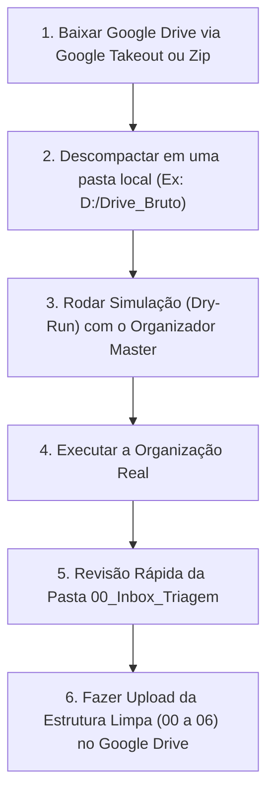

# ☁️ Guia de Triagem e Reorganização do Google Drive

Este guia foi elaborado para orientar você no **passo a passo seguro e eficiente** durante o fim de semana, quando for baixar todo o seu Google Drive, limpá-lo e reorganizá-lo.

---

## 🛠️ Passo a Passo do Fim de Semana



---

## 📋 Detalhamento dos Passos

### 1. Download do Google Drive
- **Opção Recomendada (Google Takeout)**:
  - Acesse [takeout.google.com](https://takeout.google.com).
  - Desmarque tudo e selecione apenas o **Google Drive**.
  - Solicite a exportação em arquivos `.zip` de 10 GB ou 50 GB.
- **Opção Alternativa**:
  - Pelo navegador, selecione suas pastas principais e clique em **Fazer Download**.

### 2. Descompactar em uma Pasta de Trabalho
- Crie uma pasta temporária (exemplo: `C:\Users\wheslan.quintanilha\Downloads\Drive_Bruto` ou em um disco secundário `D:\Drive_Bruto`).
- Extraia todo o conteúdo do zip nessa pasta.

### 3. Rodar a Simulação com o Script
Abra o terminal na pasta `organizador-master/` ou use o [Organizar-GoogleDrive.bat](file:///C:/Users/wheslan.quintanilha/Documents/organizador-master/scripts/Organizar-GoogleDrive.bat):

```bash
# Simular primeiro (Não move nada, só mostra onde cada arquivo vai parar)
python main.py --drive "C:\Users\wheslan.quintanilha\Downloads\Drive_Bruto" --dry-run
```

### 4. Executar a Organização
Quando estiver satisfeito com a simulação, execute:

```bash
python main.py --drive "C:\Users\wheslan.quintanilha\Downloads\Drive_Bruto"
```

O script moverá automaticamente:
- Todos os PDFs de concursos para `02_Estudos_e_Concursos`.
- Todos os livros e epubs para `02.4_Biblioteca_e_Ebooks`.
- Todos os documentos de clientes para `03_Profissional_WFIX`.
- Todas as fotos/artes para `05_Design_Midia_e_Criacao`.
- Arquivos avulsos sem regra para `00_Inbox_Triagem`.

### 5. Revisão Rápida da Caixa de Entrada (`00_Inbox_Triagem`)
- Abra a pasta `00_Inbox_Triagem` e veja se restou algum arquivo avulso raro.
- Arraste-o para a subpasta numerada de sua preferência.

### 6. Upload para o Google Drive
- No Google Drive Web, apague ou arquive as pastas bagunçadas antigas.
- Arraste as pastas numeradas `01_Pessoal_e_Vida`, `02_Estudos_e_Concursos`, `03_Profissional_WFIX`, `04_Desenvolvimento_e_Codigo`, `05_Design_Midia_e_Criacao`, `06_Backups_ISOs_e_Sistemas` direto para o Drive.
- Pronto! Seu Drive estará espelhado exatamente igual ao seu computador local.
