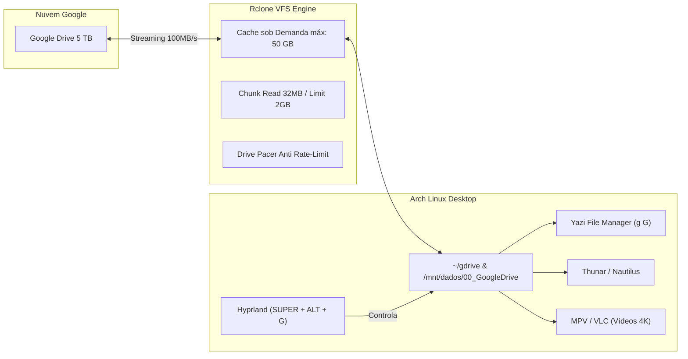

# ☁️ GUIA DEFINITIVO: GOOGLE DRIVE 5 TB & PACMAN TURBO NO ARCH LINUX
> **Zero Fricção, Streaming sob Demanda no SSD & Velocidade Máxima de Rede**

---

## 🎯 1. Visão Geral: O Problema dos 5 TB Resolvido

Ter **5 Terabytes** no Google Drive é incrível, mas armazenar tudo fisicamente em um SSD de 512 GB ou 1 TB é impossível. Métodos convencionais (como tentar sincronizar tudo ou baixar arquivos zip gigantes pelo Google Takeout) enchem o disco e travam a máquina.

Nossa arquitetura resolve isso com **Rclone VFS Streaming (Virtual File System)**:



### ✨ Benefícios Principais:
1. **Acesso Nativo como Pasta Local**: O drive aparece como uma pasta comum em `~/gdrive` e `/mnt/dados/00_GoogleDrive`.
2. **Zero Risco de Lotar o SSD**: O cache local fica **estritamente limitado a 50 GB**. Quando atinge o teto ou arquivos completam 24h sem leitura, o Rclone purga os chunks antigos automaticamente.
3. **Streaming Instantâneo de Vídeos**: Arquivos de vídeo (1080p, 4K, cursos) tocam instantaneamente no MPV/VLC sem precisar baixar o arquivo inteiro antes.
4. **Downloads sob Demanda**: Um arquivo só é puxado da nuvem quando você clica nele ou o abre em um aplicativo.
5. **Autonomia Systemd**: Montagem automática transparente no boot do sistema via serviço de usuário `rclone-gdrive.service`.

---

## ⚡ 2. Atalhos e Teclas Rápidas

| Tecla / Atalho | Ambiente | Ação |
|---|---|---|
| `SUPER + ALT + G` | **Hyprland** (Global) | **Conectar / Desconectar Google Drive** (com notificação) |
| `g G` | **Yazi** | **Pular direto** para a pasta `~/gdrive` (Google Drive) |
| `M G` | **Yazi** | **Montar / Desmontar** o Drive direto de dentro do Yazi |
| `SUPER + SHIFT + H` | **Hyprland** | Ver o atalho do Google Drive no **Cheat Sheet Mestre** |

---

## 🚀 3. Comandos de Terminal (`gdrive-mount.sh`)

O script [`gdrive-mount.sh`](file:///home/lan/dotfiles/scripts/gdrive-mount.sh) centraliza todo o gerenciamento com feedback visual Catppuccin:

```bash
# 1. Configurar conta pela primeira vez (Abre o navegador para login OAuth)
gdrive-mount.sh setup

# 2. Montar o Drive virtual sob demanda
gdrive-mount.sh mount

# 3. Desmontar de forma segura
gdrive-mount.sh unmount

# 4. Alternar entre montado e desmontado
gdrive-mount.sh toggle

# 5. Ver status detalhado, espaço total/usado e tamanho do cache local
gdrive-mount.sh status

# 6. Limpar o cache temporário local do SSD imediatamente (libera espaço)
gdrive-mount.sh clean-cache

# 7. Abrir o Google Drive no Yazi ou gerenciador gráfico
gdrive-mount.sh open
```

---

## 🔑 4. Configuração Passo a Passo da Primeira Vez (OAuth2)

Basta rodar no terminal:
```bash
gdrive-mount.sh setup
```

O assistente interativo guiará você com as seguintes opções do Rclone:

1. **New remote**: digite `n` e aperte Enter.
2. **name**: digite exatamente `gdrive` e aperte Enter.
3. **Storage type**: digite `drive` (Google Drive).
4. **client_id** e **client_secret**:
   - Para uso padrão, apenas pressione `Enter` duas vezes (deixar em branco).
   - *(Opcional Power-User)*: Se tiver criado seu próprio Client ID no Google Cloud Console, cole-os para ter sua cota de API exclusiva sem concorrência.
5. **scope**: escolha `1` (Full access to all files).
6. **service_account_file**: pressione `Enter` (em branco).
7. **Edit advanced config**: digite `n`.
8. **Use web browser to authenticate**: digite `y`.
9. O navegador abrirá automaticamente. Selecione sua conta Google com os 5 TB e clique em **Permitir**.
10. **Configure this as a Shared Drive**: digite `n` (ou `y` se o seu armazenamento for um Drive Compartilhado de equipe).
11. Confirme com `y` e saia com `q`.
12. O assistente perguntará se você quer ativar o serviço automático no boot do Arch. Confirme com `S`!

---

## ⚙️ 5. Como Funciona a Proteção VFS no Systemd

O serviço de usuário [`rclone-gdrive.service`](file:///home/lan/dotfiles/home/dot_config/systemd/user/rclone-gdrive.service) opera em segundo plano:

```ini
[Unit]
Description=Google Drive 5TB (Rclone VFS On-Demand Virtual Mount)
After=network-online.target
AssertPathExists=%h/.config/rclone/rclone.conf

[Service]
Type=notify
ExecStart=/usr/bin/rclone mount gdrive: %h/gdrive \
    --vfs-cache-mode full \
    --vfs-cache-max-size 50G \
    --vfs-cache-max-age 24h \
    --vfs-read-chunk-size 32M \
    --vfs-read-chunk-size-limit 2G \
    --buffer-size 64M \
    --dir-cache-time 72h \
    --poll-interval 15s \
    --drive-pacer-min-sleep 10ms \
    --drive-pacer-burst 200 \
    --umask 022
ExecStop=/usr/bin/fusermount3 -u -z %h/gdrive
Restart=on-failure
RestartSec=10
```

### Explicação Técnica dos Parâmetros:
- `--vfs-cache-mode full`: Permite abrir, editar, salvar e assistir a qualquer arquivo como se estivesse no disco local.
- `--vfs-cache-max-size 50G`: Cobre o cache com teto seguro. Mesmo que você assista a dezenas de filmes 4K de 80 GB, o SSD nunca enche.
- `--vfs-read-chunk-size 32M`: Leitura por blocos rápidos, permitindo seek instantâneo na linha do tempo de áudios e vídeos.
- `--buffer-size 64M`: Buffer em memória RAM para prevenir qualquer engasgo de rede.
- `--dir-cache-time 72h`: Estrutura de diretórios fica gravada em memória, abrindo instantaneamente no Yazi e Thunar sem consultar a API toda vez.
- `--poll-interval 15s`: Detecta arquivos novos criados no celular ou na web a cada 15 segundos.

---

## 🏎️ 6. Bônus: Pacman Turbo Extremo & Makepkg Multi-Core

Além do Google Drive, todo o gerenciamento de pacotes do Arch Linux foi turbinado para atingir a velocidade máxima de rede e CPU:

### 1. Pacman com 10 Downloads Paralelos
Em `/etc/pacman.conf`:
- `ParallelDownloads = 10`: Baixa até 10 pacotes simultaneamente, saturando conexões gigabit.
- `Color` & `ILoveCandy`: Interface limpa e animada no terminal.

### 2. Makepkg Multi-Core Turbo (AUR 10x Mais Rápido)
Em `/etc/makepkg.conf`:
- `MAKEFLAGS="-j$(nproc)"`: Compila pacotes do AUR (como yay, vesktop, kernels) utilizando **todos os núcleos e threads** da CPU (ex: 8, 12, 16 ou 32 threads simultâneas).
- `COMPRESSZST=(zstd -c -z -q --threads=0 -)`: Compactação e descompactação de pacotes multithread ultraveloz.

### 3. Otimização de Espelhos com Reflector
Rankeia os espelhos mais próximos geograficamente (Brasil, Chile, Argentina) com menor latência e maior taxa de transferência:
```bash
# Atualizar mirrors mais rápidos da América do Sul agora:
bash ~/dotfiles/scripts/sys-maintenance.sh mirrors

# Ativar todas as flags turbo do Pacman e Makepkg:
bash ~/dotfiles/scripts/sys-maintenance.sh turbo
```

### 4. Manutenção Automática do Cache
O timer `paccache.timer` mantém apenas as 2 versões mais recentes de cada pacote instalado, liberando dezenas de gigabytes sem você precisar se preocupar.

---

## 🛡️ 7. Diagnóstico e Resolução de Dúvidas

> [!NOTE]
> **Dúvida**: O que acontece se eu ficar sem internet?
> Os arquivos que já estão em cache (`~/.cache/rclone/vfs/gdrive`) continuam abrindo normalmente. Arquivos que ainda não foram baixados retornarão aviso de rede até a conexão voltar.

> [!TIP]
> **Dica de Velocidade**:
> Se quiser ver o consumo em tempo real do cache, execute `gdrive-mount.sh status`. Para esvaziar o cache manualmente e liberar espaço no SSD para um jogo novo, rode `gdrive-mount.sh clean-cache`.
