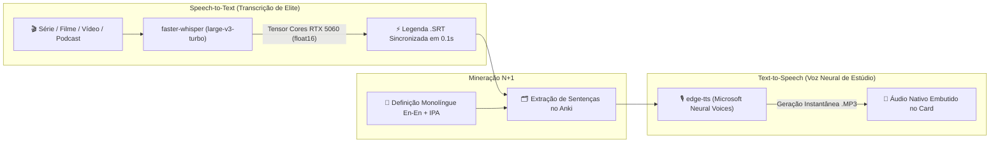

# 🎙️ Cockpit AI de Imersão & Mineração Anki (Whisper Large-v3-Turbo + Edge-TTS)

> **Status:** 🚀 Planejado / Arquitetado para Implementação  
> **Objetivo:** Orquestrar um pipeline local de altíssima performance para Inteligência de Áudio e Aquisição de Idiomas (Inglês C1, Espanhol, Francês) usando aceleração por hardware na **NVIDIA GeForce RTX 5060** + **Ryzen 7 5700X** no Arch Linux.

---

## 🏛️ 1. Visão Geral da Arquitetura

O sistema une dois motores neurais de código aberto/gratuitos para eliminar 100% da fricção no estudo monolíngue e na mineração de sentenças $n+1$:



---

## 📊 2. Benchmarks no Hardware Alvo (RTX 5060 8GB + Ryzen 7 5700X + 32GB RAM)

* **Engine:** `faster-whisper` com backend CTranslate2 e aceleração CUDA FP16/INT8.
* **Modelo:** `deepdml/faster-whisper-large-v3-turbo` (809M parâmetros).
* **VRAM Alocada:** ~3.8 GB a 6.2 GB (confortável dentro dos 8GB da GPU).
* **Velocidade de Processamento (RTF):**
  * Frase isolada de 5 segundos: `< 0.1s` (instantâneo).
  * Vídeo de 20 minutos (episódio/anime): `~15 a 25 segundos`.
  * Podcast de 1 hora: `~45 a 60 segundos`.
* **Carga de CPU:** Ociosa (~5-10%), liberando o Ryzen 7 para compilação Java/Spring e Neovim.

---

## 🛠️ 3. Pacotes & Setup no Arch Linux

### Dependências Nativas (Pacman):
```bash
sudo pacman -S --needed cuda cudnn ffmpeg python-pip python-virtualenv base-devel
```

### Ambiente Isolado do Cockpit:
```bash
mkdir -p ~/App/whisper-env
cd ~/App/whisper-env
python -m venv venv
source venv/bin/activate

# Instalação dos motores otimizados
pip install --upgrade pip
pip install faster-whisper edge-tts
```

---

## 📜 4. Script de Automação: `transcribe_and_synth.py`

```python
#!/usr/bin/env python3
"""
transcribe_and_synth.py - Transcrição Ultrarrápida com Whisper Large-v3-Turbo + Aceleração CUDA
"""
import os
import sys
from faster_whisper import WhisperModel

def format_time(seconds: float) -> str:
    """Formata o tempo para o padrão de legendas SRT (HH:MM:SS,mmm)"""
    hours = int(seconds // 3600)
    minutes = int((seconds % 3600) // 60)
    secs = int(seconds % 60)
    milliseconds = int((seconds % 1) * 1000)
    return f"{hours:02d}:{minutes:02d}:{secs:02d},{milliseconds:03d}"

def transcribe_media(file_path: str, lang: str = "en"):
    print(f"[-] Carregando Whisper Large-V3-Turbo na RTX 5060 (CUDA float16)...")
    model = WhisperModel("deepdml/faster-whisper-large-v3-turbo", device="cuda", compute_type="float16")
    
    print(f"[-] Transcrevendo: {file_path}")
    segments, info = model.transcribe(file_path, beam_size=5, language=lang)
    
    srt_output = os.path.splitext(file_path)[0] + ".srt"
    with open(srt_output, "w", encoding="utf-8") as f:
        for idx, seg in enumerate(segments, start=1):
            start_str = format_time(seg.start)
            end_str = format_time(seg.end)
            text_str = seg.text.strip()
            f.write(f"{idx}\n{start_str} --> {end_str}\n{text_str}\n\n")
            print(f"[{start_str} -> {end_str}] {text_str}")
            
    print(f"[+] Legenda gerada com sucesso: {srt_output}")

if __name__ == "__main__":
    if len(sys.argv) < 2:
        print("Uso: python transcribe_and_synth.py <arquivo_audio_ou_video> [idioma (en/es/fr)]")
        sys.exit(1)
    target_lang = sys.argv[2] if len(sys.argv) > 2 else "en"
    transcribe_media(sys.argv[1], target_lang)
```

---

## 🎙️ 5. Síntese de Voz Nativa para Flashcards com `edge-tts`

Comando de 1 linha para gerar o áudio neural nativo de qualquer frase $n+1$ e injetar direto no Anki:

```bash
# Sotaque Americano (Brian / Christopher)
edge-tts --voice en-US-BrianNeural --text "The architecture of distributed systems requires deep consideration of network latency." --write-media sentence_01.mp3

# Sotaque Britânico (Ryan)
edge-tts --voice en-GB-RyanNeural --text "We need to ensure rigorous idempotency across all database migrations." --write-media sentence_02.mp3

# Espanhol Castelhano / Latino (Alvaro)
edge-tts --voice es-ES-AlvaroNeural --text "El rendimiento del sistema supera todas las expectativas." --write-media sentence_es.mp3

# Francês (Henri)
edge-tts --voice fr-FR-HenriNeural --text "La persévérance est la clé de la maîtrise intellectuelle." --write-media sentence_fr.mp3
```

---

## 🔗 6. Integração com o MPV & AnkiConnect

* **No MPV (`input.conf`):** O atalho `M` fatia a frase do vídeo via `ffmpeg` e sincroniza com o AnkiConnect na porta `8765`.
* **Mídia do Anki:** Os arquivos gerados são salvos diretamente em `~/.local/share/Anki2/Usuário 1/collection.media/`.
* **Zero Tradução:** Front do card com a frase minerada + Back do card com definição em inglês (Monolíngue) + Áudio neural instantâneo.
